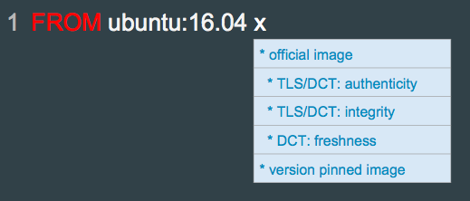
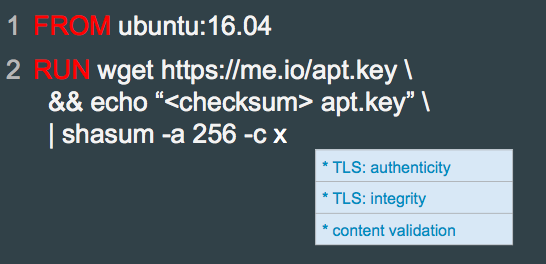
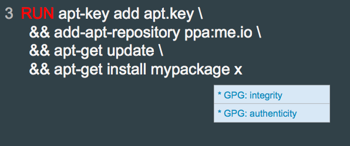
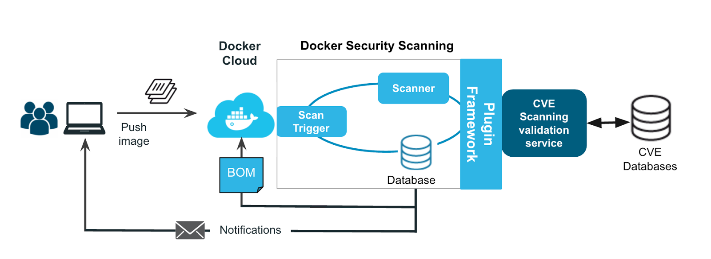
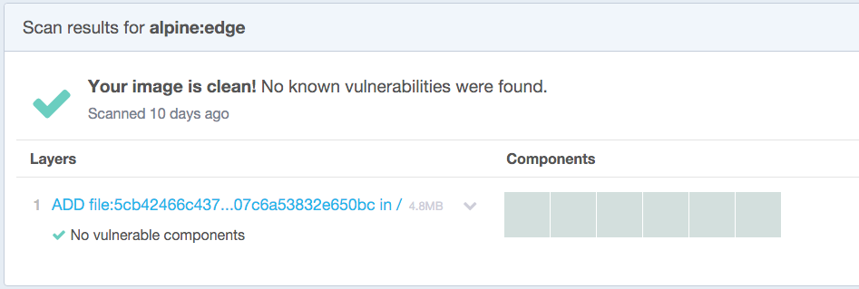

## Content Security: Image Construction & Scanning
<p></p>

Note:
The second major element of Docker security is image security. How can we proactively inspect an image to decide if it's safe to use or not?

---

## The Image Layered Filesystem

- Union filesystem
  - Combine multiple layers to look like a single filesystem
  - Tombstoning/whiteout files to delete files from lower layers
- Copy-on-write
  - Image layers are read only, and shared between containers
- More info: [https://docs.docker.com/engine/userguide/storagedriver/imagesandcontainers/](https://docs.docker.com/engine/userguide/storagedriver/imagesandcontainers/)

Note:

 - One of our key security concerns comes from understanding what's in an image
 - Docker images are more complex than a simple filesystem
 - in order to promote performance and resource sharing, images are built as a layered filesystem
 - layers shared between images are not copied
 - key security implication is that an image's layers are read-only

---

## Supported Implementations

- Image layering and sharing with AUFS (unification filesystem)
- Locked Image Layers (read only)


Note: 
 - Each Docker image references a list of read-only layers.

 - AUFS is a unification filesystem. This means that it takes multiple directories on a single Linux host, stacks them on top of each other, and provides a single unified view. To achieve this, AUFS uses a union mount.

 - AUFS stacks multiple directories and exposes them as a unified view through a single mount point. All of the directories in the stack, as well as the union mount point, must all exist on the same Linux host. AUFS refers to each directory that it stacks as a branch.

 - Within Docker, AUFS union mounts enable image layering. The AUFS storage driver implements Docker image layers using this union mount system. AUFS branches correspond to Docker image layers. The diagram below shows a Docker container based on the ubuntu:latest image.

---

## Copy-on-write

- The major difference between a container and an image is the top writable layer.
- Each containers get its own writable layers
- Reduces the amount of space consumed by containers
- Reduces the time required to start a container


Note:
 - All writes to the container that add new or modify existing data are stored in this writable layer. When the container is deleted the writable layer is also deleted. The underlying image remains unchanged.

 - Because each container has its own thin writable container layer, and all changes are stored in this container layer, this means that multiple containers can share access to the same underlying image and yet have their own data state. The diagram below shows multiple containers sharing the same Ubuntu 15.04 image.

 - Docker’s copy-on-write strategy not only reduces the amount of space consumed by containers, it also reduces the time required to start a container

---

## Image Identities by digest

- Image id
- Tag
- Digest

```
$ docker images --digests
REPOSITORY     TAG       DIGEST                          IMAGE ID       CREATED...          
debian         latest    sha256:e7d38b3517548a1c...0aa   f50f9524513f   8 weeks...
busybox        latest    sha256:4a731fb46adc5cef...a92   47bcc53f74dc   11 days...
user/myrepo    latest    sha256:ea0d1389812f43e4...950   f9858dea7747   6 hours...


$ notary -d ~/.docker/trust list docker.io/user/myrepo
   NAME                       DIGEST                       SIZE (BYTES)    ROLE    
---------------------------------------------------------------------------------
  latest   ea0d1389812f43e474c50155ec4914e1b48792...950    1360           targets  
```

Content specified by image digests are immutable, while content specified by tag can change.

Note:
 - Images have a content-addressable identifier called a digest. As long as the input used to generate the image is unchanged, the digest value is predictable. To list image digest values, use the --digests flag.

 - Each image is identified with a particular sha256 hash.  That hash can also be associated with a tag, and that association can be certified using Content Trust, which expires after a time and needs to be re-certified.

---

## Best Practice: Start with official an image
- official image in `Dockerfile`



Note: 
In a dockerfile, the first known good component you can start off with is an official image as the base image.  These are commonly used combination of components that are well documented, try to promote best practices, and are actively curated and maintained.  They are regularly scanned for vulnerabilities, and official images are provided over HTTPS from Docker Hub, providing authenticity and integrity guarantees of the image.  They are also signed using Docker Content Trust, which has been covered at previous DockerCons and will be covered in the next portion of this talk.  But briefly, Content Trust will additionally provide freshness guarantees so that you know that official images are not outdated.

Notice that the image version is specified; this is important because you don’t want your application to suddenly start misbehaving only because the underlying components changed drastically without you knowing.  You probably don’t want to pin to a specific image digest, however - while pinning to a specific version does not necessarily mean the underlying components will not change (because they will probably be patched for vulnerabilities), the components you depend on should maintain API compatibility.

---

## Best Practice: use *minimal* base images

- Add only what you need

|     |        |
|--------:|----:|
|alpine|  ubuntu|				
| ~ 2 MB from hub (1 layer!) | ~ 50 MB from hub|
| musl libc and busybox|   |


---

## Best Practice: Check Dependency by Checksum

- If you download a dependency:
  - Use TLS
  - Pin to a particular checksum



Note: 
If you download a dependency, try to make sure it's downloaded via TLS so you can get authenticity and integrity guarantees.  If you can’t pin to a particular version, you can pin to a particular checksum.  Ideally you would be able to download the dependency by checksum from a content-addressable store, but if not you can always validate the checksum after it’s been downloaded.

---

## Best Practice: Download with Package Manager Security Key

- If your package manager provides a way to guarantee authenticity and integrity, use it!



Note: If your package manager provides a way to guarantee authenticity and integrity, use it;  debian apt repositories GPG-sign packages for instance, and apt validates the signature when you download and install the package.  So make sure you download the relevant GPG key.

---

## Best Practice: verify content before download

```
RUN apt-key adv \
      --keyserver hkp://keyserver.ubuntu.com:80 \
      --recv-keys BBEBDCB318AD50EC6865090613B00F1FD2C19886 \
    && echo deb http://repository.spotify.com stable non-free \
    | sudo tee /etc/apt/sources.list.d/spotify.list
```

Note:
 - the apt example is to advocate key pinning when fetching dependencies for dockerfiles (when building images)
 - use this or some other integrity guarantee when installing packages (as true in Dockerfiles as it is generically a good idea)
 - most secure way to retrieve images from registries is using DCT
 - Install spotify ubuntu with installation step (instruction: https://www.spotify.com/us/download/linux/) in Dockerfile,

 - 1. Add the Spotify repository signing key to be able to verify downloaded packages:
sudo apt-key adv --keyserver hkp://keyserver.ubuntu.com:80 --recv-keys BBEBDCB318AD50EC6865090613B00F1FD2C19886

 - 2. Add the Spotify repository
echo deb http://repository.spotify.com stable non-free | sudo tee /etc/apt/sources.list.d/spotify.list

 - 3. Update list of available packages
sudo apt-get update

 - 4. Install Spotify
sudo apt-get install spotify-client

apt-key is used to manage the list of keys used by apt to authenticate
       packages. Packages which have been authenticated using these keys will
       be considered trusted.


To see where gpg is store, $ apt-key list
/etc/apt/trusted.gpg


 Output:
```
sudo apt-key adv \
> --keyserver hkp://keyserver.ubuntu.com:80 \
> --recv-keys BBEBDCB318AD50EC6865090613B00F1FD2C19886 \
> && echo deb http://repository.spotify.com stable non-free \
> | sudo tee /etc/apt/sources.list.d/spotify.list
Executing: gpg --ignore-time-conflict --no-options --no-default-keyring --homedir /tmp/tmp.3pCONPTxxp --no-auto-check-trustdb --trust-model always --keyring /etc/apt/trusted.gpg --primary-keyring /etc/apt/trusted.gpg --keyserver hkp://keyserver.ubuntu.com:80 --recv-keys BBEBDCB318AD50EC6865090613B00F1FD2C19886
gpg: requesting key D2C19886 from hkp server keyserver.ubuntu.com
gpg: key D2C19886: "Spotify Public Repository Signing Key <operations@spotify.com>" not changed
gpg: Total number processed: 1
gpg:              unchanged: 1
deb http://repository.spotify.com stable non-free
ubuntu@manager:~$ cat /etc/apt/sources.list.d/spotify.list
deb http://repository.spotify.com stable non-free
```


```
$ apt-key list
/etc/apt/trusted.gpg
--------------------
pub   4096R/2C52609D 2015-07-14
uid                  Docker Release Tool (releasedocker) <docker@docker.com>

pub   4096R/D2C19886 2015-05-28 [expires: 2017-11-22]
uid                  Spotify Public Repository Signing Key <operations@spotify.com>
```

---

##Best Practice: read only containers

```
$ docker run -it --read-only alpine sh
```
Mounts FS of container as read-only

---

## Best Practice: read-only Volumes

```
docker run -it -v /data:/data:ro alpine sh
```

---

## Common mistake: mount host location as writable

```
$ docker run it --rm -v /:/host alpine sh
```

---

## Best Practice: minimal, read-only mounts

```
$ docker run it --rm -v /subdir/we/need:/dir:ro alpine sh
```

---

## Docker Security Scanning


- Checks against CVE database for declared layers
- Also performs binary scan to pick up on
statically linked binaries
- Official repos have been scanned since Nov 2015, are rescanned often

---

## Best Practice: Docker Security Scanning


https://hub.docker.com/r/library/alpine/tags/
- All official images on hub are scanned for vulnerabilities, lobby upstream for fixes!
- Can view scan results after logging into Docker Hub


---
