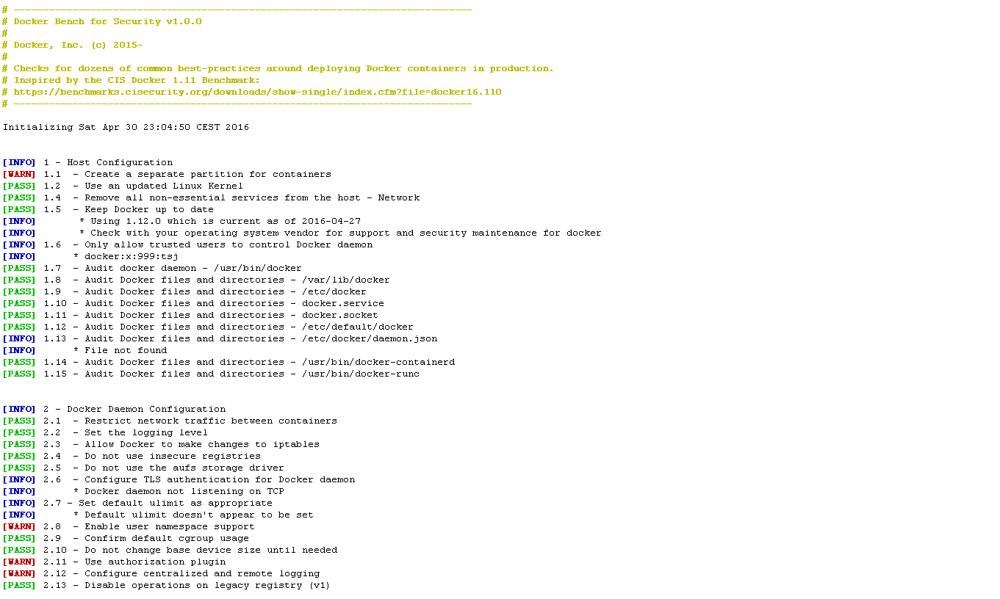

# Docker Security Workshop

Note:
 - Topic: Docker Security Deep Dive
 - Level: Advanced
 - Time: 7 hours
 - Validated against: Ubuntu 14.04 + Docker Engine 1.12

---

## Course Objectives

- During this course, you will learn

  - How the Docker platform is secure be default
  - What issues and add-ons to consider when proactively securing Docker
  - Docker security best practices
  - Secure user management

Note:
We will cover the followings;
- how docker reinforces security by default,
- and what actions you can take to go even further than docker's passive security.

---

## Agenda

- Overview of Docker Security
- Isolation: Kernel Namespaces and Control Groups
- User Management
- Image Security
- Networks
- Image Distribution
- Capabilities
- Seccomp
- Linux Security Modules

Note:
As with networking and everything else Docker, most of what we're going to see are all uses of core linux features.

---

## Overview of Docker Security

Get the latest: [https://www.docker.com/docker-security](https://www.docker.com/docker-security)

---

## Are Docker Containers Secure?

- Is it safe to run applications in Docker containers?
- Can one Docker container break out and into another?
- What is inside my container?
- How do I know where this code came from?
- How do I keep our team safe from bad components?
- How do I stay on top of patches for compliance and governance?

**Container isolation, provenance and inspection are the central issues.**

Note: 
Docker's guiding principle is to be able to build, ship, and run any application, anywhere - what this looks like in practice is these containers which not only move between infrastructure quickly and frequently, but can pass through many hands during their development, including third party publishers external to your organization. So secuing the software supply chain that Docker provides centers on three main needs: the need to isolate containers from one another and the underlying OS to limit the scope of intrusions, the need to make inquiry of exactly what's in these containers, for the purposes of deciding if the contents are safe to use or not, and the need to track provenance of the hands this image has passed through.

---

## Docker Security High-Level Overview


Note: 
 - We said above that our key security concerns are containment, provenance and inspection
 - What this looks like operationally is a three-pillar security strategy:
  - securing the platform: isolation, default encryption; as much out of the box as possible
  - securing the content: provenance via image signing, content integrity through inspection tools
  - securing access: RBAC, trusted registries

---

## Platform Security: Docker Passive Security

Core linux technology provides an additive security layer on top of any existing application: 

  - *kernel namespaces* : container processes can't traverse the host pid tree
  - Control Groups, *cgroups* : limit the access processes and containers have to system resources such as CPU, RAM, IOPS and network.
  - Each container also gets its own *network namespace*, meaning that a container doesn't get privileged access to the sockets or interfaces of another container.

More details: [https://docs.docker.com/engine/security/security/](https://docs.docker.com/engine/security/security/)

Note: 
Docker security passively leverages the linux kernel to provide security that is additive to any application.

Kernel namespaces provide the first and most straightforward form of isolation: processes running within a container cannot see or affect processes running in another container, or on the host system.

Control Groups, are a feature of the Linux kernel that allow you to limit the access processes and containers have to system resources such as CPU, RAM, IOPS and network.

Each container also gets its own network stack, meaning that a container does not get privileged access to the sockets or interfaces of another container.

---

##  Docker aims to be Secure by Default

Docker passively mitigates a growing list of Common Vulnerabilities and Exposures (CVE) such that processes run in Docker containers were never vulnerable, even before the issue was fixed. See [https://docs.docker.com/engine/security/non-events/](https://docs.docker.com/engine/security/non-events/) for the growing list:

[CVE-2013-1956](https://cve.mitre.org/cgi-bin/cvename.cgi?name=CVE-2013-1956), 1957, 1958, 1959, 1979, CVE-2014-4014, 5206, 5207, 7970, 7975, CVE-2015-2925, 8543, CVE-2016-3134, 3135, CVE-2014-0181, CVE-2015-3339, CVE-2014-4699, CVE-2014-9529, CVE-2015-3214, 4036, CVE-2016-0728, CVE-2016-2383...

Note: 
This assumes containers are run without adding extra capabilities or not run as --privileged.

---

## Platform Security: Docker Active Security

- Extra steps can be take to _harden_ applications by enabling thinks like **seccomp**, **capabilities**, **AppArmor**, **SELinux**

  - `seccomp` (short for secure computing mode): provides an application sandboxing mechanism in the Linux kernel.

  - `capabilities` : provide fine-grained control over superuser permissions, allowing use of the root user to be avoided.

  - `AppArmor` : kernel enhancement to confine programs to a limited set of resources, and bind access control attributes to programs.

  - `SELinux` (Security-Enhanced Linux): provides a mechanism for supporting access control security policies.

Note:
In addition to passive security, there's a bunch more configurable things you can use to reinforce your application security.

---

## Platform Security: Intra-Cluster Communication
 - Two major channels of communication within the Docker platform:
   - Client / daemon communication
   - Inter-node communication in Swarm Mode
 - Docker supports TLS encryption for both these channels.
 - Docker operates its own CA by default, or can accept an external CA optionally.


Note: 
- Communication security becomes even more important when joining nodes together via Swarm.
- That's why the Docker platform enables mutual TLS be default in Swarm Mode.
- Swarm leader operates a CA which provides the certificates for this. 

---

## Content Security: Security Scanning

- Essentially an automated CVE audit.

  - Docker Cloud and Docker Hub can scan images in private repositories to verify that they are free from known security vulnerabilities or exposures
  - Report the results of the scan for each image tag
  - Detailed bill of materials (BOM) of included components and vulnerability profile
  - Checks packages against CVE database AND the code inside to protect against tampering
  - More info: [https://docs.docker.com/docker-cloud/builds/image-scan/](https://docs.docker.com/docker-cloud/builds/image-scan/)

Note:
 - The second pillar of Docker's security strategy is content security, which we pursue passively through the image signing we saw earlier with content trust, and actively through image scanning, which is essentially an automated CVE audit.
 - The idea here is to inspect each layer of the layered file system Docker uses to build images, and validate them against a database of CVE.

---

##Image scanning and vulnerability detection


Note:
Architectural diagram.

Security scanning is a service made up of a scan trigger which implements the APIs, the scanner, database, plugins.  The CVE scanning is a third party that plugs into our service that checks against the public CVE database.  So what happens?

- A user/publisher pushes their image to their repo in Docker Cloud
- The scan trigger kicks off the workflow by pulling the image from the repo, sending to the scanner service
- The scanner service breaks up the image into layers and components then sends that to our validation service which checks each package against the CVE database and scans the binaries to make sure the contents of the packages are what they say they are.
- Once complete, the data is sent back to security scanning and stored in our database as a JSON.  Those results per image are then sent back to Docker Cloud to be displayed in UI to the user.
- If a new vulnerability is reported to the CVE database, a notification is sent to the security scanning service.  From there we check against our database and issue a notification to the account admin about the vulnerability and which repos and tags are affected.

Plugin framework - today we have one validation service connected but security scanning was designed in a way to easily add different validation services as needed

---

## Docker Security Scanning results


Note:
Docker Cloud can help by automating this vetting process.   If the security scanning service is enabled for a repository, then all the images can be easily audited for vulnerabilities, and the licenses for the components in the images can be viewed.  

---

## Docker Security Scanning Notification via Email


Note:
Docker Cloud can help by automating this vetting process.   If the security scanning service is enabled for a repository, then all the images can be easily audited for vulnerabilities, and the licenses for the components in the images can be viewed.  

---

## Access Security: Docker Trusted Registry

- The enterprise-grade **image storage** solution from Docker
- Securely store and manage the Docker images **behind firewall**
- Installed on-premises, or on a virtual private cloud
- Use as continuous delivery processes to build, ship and run your applications
- Built-in security and access control
  - integrates with LDAP and Active Directory
  - Supports **Role Based Access Control** (RBAC)
- More info: [https://docs.docker.com/datacenter/dtr/2.0/architecture/](https://docs.docker.com/datacenter/dtr/2.0/architecture/)

Note:

 - The final pillar of the Docker security strategy is essentially access control. We've already seen DTR in action; trusted registry provides all the funtionality that the public or cloud-based registries do, but via a private, gate-kept registry you can park on prem, behind as many firewalls and external security devices as your security compliance standards demand.
 - In addition, DTR provides RBAC and optional LDAP authentication, for fine-grained access control to your collection of images.

---

## DTR: Image Management


---

## DTR: Built-in Security and Access Control

- Who can access and what can a user can access


---

## Best Practice linter: Docker Bench
- Open source auditing Tool http://dockerbench.com
- A script that checks for dozens of common best-practices around deploying Docker containers in production.
- Command to run your hosts against Docker Bench

```
git clone https://github.com/docker/docker-bench-security.git
cd docker-bench-security
docker build -t docker-bench-security .
docker run -it --net host --pid host --cap-add audit_control \
    -v /var/lib:/var/lib \
    -v /var/run/docker.sock:/var/run/docker.sock \
    -v /usr/lib/systemd:/usr/lib/systemd \
    -v /etc:/etc --label docker_bench_security \
    docker/docker-bench-security
```  

More details: [https://blog.docker.com/2015/05/understanding-docker-security-and-best-practices/](https://blog.docker.com/2015/05/understanding-docker-security-and-best-practices/)

Note:
- Usage via Compose: docker-compose run --rm docker-bench-security
- Usage via script: sh docker-bench-security.sh

---

## Docker Bench Output
Run your hosts against the Docker Bench


---

## Docker secures your software supply chain


---

## Summary: What makes Docker secure?

- Secure platform with strong default policies that you can further enhance.
- Docker enforce communications over TLS
- Credentials for users, for deployment hosts, and for users, and can enforce the access controls
- Expiring signing mechanism for you with Docker Content Trust
- Proactive vulnerability management through Docker Security Image Scanning
- Secure Inventory management tools, UCP, and DTR
- Secure swarm cluster
- Docker Bench for audit the security of your individual docker hosts

Note:

So to summarize, at high level Docker's security concerns are served by a three-pronged strategy:
 - platform security, via things like namespacing and TLS encryption, to keep the environment Docker is running in secure
 - content security, via things like content trust and image scanning, to make sure the images we're using are vulnerability-free and come from trusted sources
 - access security, via things like dtr, to tightly control access to our collections of images.

---