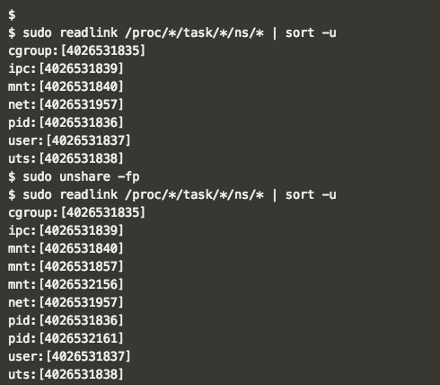
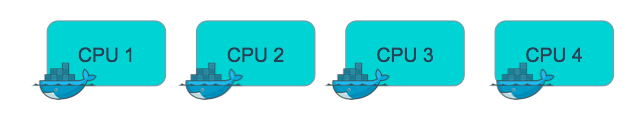
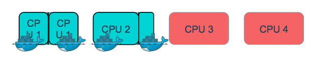
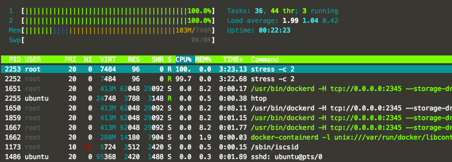
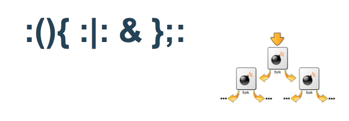

## Platform Security: Isolation via Kernel Namespaces and Control Groups

Note:
 - Platform security, which was our first major pillar of security concerns in Docker, rests largely on managing what processes can access. By keeping things well segmented, we mitigate the risk of malicious action in one container gaining control of other containers or of host system resources.

---

## Linux Kernel namespaces

- Core containerization tool that prevents processes from colliding or interfering with each other.

|Namespace|constant |Isolates|
|-------|:---------------:|:-----|
|cgroup |CLONE_NEWCGROUP  |Cgroup root directory|
|IPC    |SCLONE_NEWIPC    |System V IPC, POSIX message queues|
|Network|		CLONE_NEWNET	|	Network devices, stacks, ports, etc.|
|Mount	|	CLONE_NEWNS	    |	Mount points|
|PID	  |		CLONE_NEWPID  |	Process IDs|
|User	  |		CLONE_NEWUSER	|	User and group IDs|
|UTS		|	CLONE_NEWUTS	  |	Hostname and NIS domain name|

Note:
 - Kernel namespaces are one of the key linux features that makes practical containerization feasible.
 - allows us to isolate processes, giving them their own PID trees, user ranges, network stacks, mount points etc
 - [if people don't have a sense of how this stuff works, see PID tree example at https://www.toptal.com/linux/separation-anxiety-isolating-your-system-with-linux-namespaces]
 -  we'll see this again soon, when we think about uid ranges for containers.

---

## Kernel Namespaces for docker container: what containers can see

- Namespaces are detailed in ``/proc/<pid>/ns``
- Each process is in one namespace of each type

```
> sudo ls -la /proc/1512/ns                                                                                                 
total 0                                                                                                                     
dr-x--x--x 2 root root 0 Nov  8 04:12 .                                                                                     
dr-xr-xr-x 9 root root 0 Nov  8 04:05 ..                                                                                    
lrwxrwxrwx 1 root root 0 Nov  8 04:12 ipc -> ipc:[4026531839]                                                               
lrwxrwxrwx 1 root root 0 Nov  8 04:12 mnt -> mnt:[4026531840]                                                               
lrwxrwxrwx 1 root root 0 Nov  8 04:12 net -> net:[4026531956]                                                               
lrwxrwxrwx 1 root root 0 Nov  8 04:12 pid -> pid:[4026531836]                                                               
lrwxrwxrwx 1 root root 0 Nov  8 04:12 user -> user:[4026531837]                                                             
lrwxrwxrwx 1 root root 0 Nov  8 04:12 uts -> uts:[4026531838]
```

Note: 
Every container lives in its own namespace, or rather set of namespaces, for each of the features listed above.

---

## Example using namespaces directly

- Using namespaces API `unshare()` to move the calling process to a new namespaces.

- Create a shell process with pid and fs namespaces.

```
$ sudo unshare -fp
$ sudo unshare -fp --mount-proc
```


---

## Control Groups

Container resource metering and limiting for assets like:

- CPU
- Memory
- PIDs
- Block I/O
- network (with cooperation from iptables/tc)

Note:
 - cgroups set resource usage limitations on groups of processes
 - prevents a container from eating up all your cluster's resources
 - CPU and cpuset groups, for example, allocate and pin CPU usage.

---

## CPU cgroup

- Keeps track of user/system CPU time
- Keeps track of usage of CPU
- Allows to set weights
- Can't set CPU time

Note:
For example, the CPU cgroup allows us to manage CPU utilization of processes.

---

## Without the CPU cgroup:

Running 4 continers on 4 different CPUs



Note:
Without the influence of cgroups, containers may consume all CPUs on a node.

---

## With cgroup CPU allocation

- CPU cgroup control is exposed by a few docker run flags:
  - `--cpu-shares`	CPU shares (relative weight)
  - `--cpuset-cpus`	CPUs in which to allow execution (0-3, 0,1)
  - `--pids-limit`	Tune container pids limit (set -1 for unlimited)



Note:
Using these flags with docker run invokes cgroups under the hood to limit system resource allocation.

---

## Docker Run with ``--cpuset-cpu``

`htop` output using ``--cpuset-cpu`` to 2



Note:
Same idea here.

---

## cgroups: PID Limits

PID limit stops fork bombs from swamping the pid tree.



Note:
 - scripting enthusiasts will recognize a bash fork bomb, a cute way to blow up a host's pid tree

----

## Do not Start Docker Container with Full container capabilities `--privileged`

- lifts all cgroup limitations.  
- the container can then do almost everything that the host can do.
- This flag exists to allow special use-cases, like running Docker within Docker.

---

## Hands-On Exercise:
www.katacoda.com/docker-training/courses/security-course

**cgroups** scenario

---
