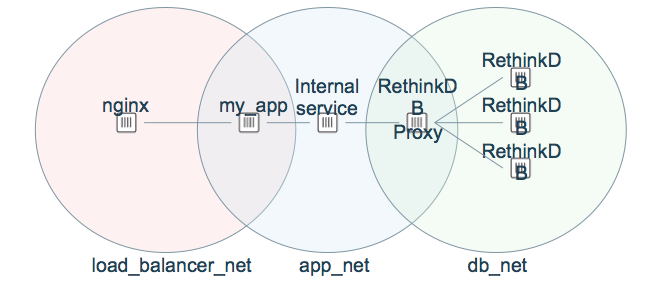

## Platform Security: Networks

---

## Isolate Services
Control which services can talk to which other services
- Easier to audit
- Networks firewalled from each other by default; inhibits ability of compromised container to communicate.

---

## Links (legacy)
Allow 2 specific containers to talk to each other.
- Brittle: does not survive container restarts
```
docker run -d --name db mysql:latest
docker run -d --link db wordpress
```

---

## Network Namespace

```
docker network create my_app
docker run -it --rm --network=my_app alpine sh
```
Links are dynamic, can be created to not yet created containers.  

---

## Best Practice: Use Multiple Networks



---

## Common Mistake: --network=host

Container can see
**ALL**
 network traffic, including traffic on docker virtual networks

---

## Common Mistake: ports exposed on host

 - Usually unnecessary
 - Creates conflicts
 - Many bots constantly scanning AWS etc for open Docker ports

---
