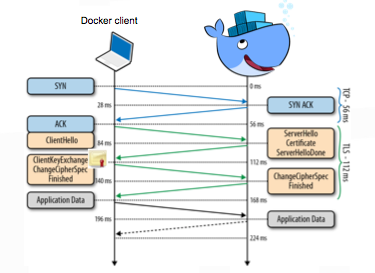

## Platform Security: Intra-Platform Communication
<p></p>

Note:
Another major area of platform security for Docker is securing the communications between all of Docker's moving parts. Specifically, this means:
 - securing communication between the docker client and daemon
 - securing communication between nodes in swarm mode.

---

## Docker daemon socket & TLS certificates

- Docker runs via a non-networked Unix socket in default mode.
- Docker can communicate using an HTTP socket between docker client and docker engine
  - Enable TLS by specifying the `tlsverify` flag
  - `tlscacert` flag to a trusted CA certificate.
- Exposing Docker Engine on a network port:

```
#Edit config at /lib/systemd/system/docker.service
- ExecStart=/usr/bin/docker daemon -H fd://
+ ExecStart=/usr/bin/docker daemon -H fd:// -H tcp://0.0.0.0:2376

#Restart Docker

$ sudo systemctl daemon-reload
$ sudo systemctl restart docker
```

More details: [https://docs.docker.com/engine/security/https/](https://docs.docker.com/engine/security/https/)

Note:
By default Docker (and by extension Docker Swarm) has no authentication or authorization on its API, relying instead on the filesystem security of its unix socket /var/run/docker.sock which by default is only accessible by the root user.

Docker supports using TLS certificates (both on the server and the client) to provide proof of identity. When set up correctly it will only allow clients/servers with a certificate signed by a specific CA to talk to each other. While not providing fine grained access permissions it does at least allow us to listen on a TCP socket and restrict access with a bonus of also providing encryption.

---

## Daemon / Client communication with cert and key

- Make the Docker daemon only accept connections from clients providing a certificate trusted by our CA:

```
$ dockerd --tlsverify --tlscacert=ca.pem --tlscert=server-cert.pem --tlskey=server-key.pem \
  -H=0.0.0.0:2376
```

- Connect to Docker and validate its certificate

```
$ docker --tlsverify --tlscacert=ca.pem --tlscert=cert.pem --tlskey=key.pem \
  -H=$HOST:2376 version
```

Note:
(No need to dwell on explicitly doing this - just an illustration of what setup and connection looks like).

---

## Secure Docker client by default

- Instead of passing ``-H=tcp://$HOST:2376`` and ``--tlsverify`` on every call

  1. Move the files to the ``.docker`` directory in your home directory
  2. Set the ``DOCKER_HOST`` and ``DOCKER_TLS_VERIFY`` variables

```
$ mkdir -pv ~/.docker
$ cp -v {ca,cert,key}.pem ~/.docker
$ export DOCKER_HOST=tcp://$HOST:2376 DOCKER_TLS_VERIFY=1
```

More explicit instructions: [http://stackoverflow.com/questions/38286564/docker-tls-verify-docker-host-and-docker-cert-path-on-ubuntu](http://stackoverflow.com/questions/38286564/docker-tls-verify-docker-host-and-docker-cert-path-on-ubuntu)

Note:
We can hide all this cruft away behind the scenes with the following.

Also note Docker Machine does all this by default.

---

## Enhance Docker Client-Engine Communication with Mutual TLS

- Client also presents certificate   
  - Sends after verifying server cert
  - Mutual authentication             
- Client CA on daemon (engine)         

cert and key   cert and key

Note: 
Mutual TLS is even better, especially when exposing Docker Engine on a network.

---

## Swarm Mode: Mutual TLS By Default

 - Inter-node communication is 2-way TLS encrypted in Swarm Mode with no setup required.
 - Swarm Mode will use its own CA, or you can provide an external one.
 - Certificate roation enabled by default (90 day default, 30 minute minimum)

Note:
Mutual TLS with cert rotation is on by default in swarm mode.

---

## Host Identities Management in Swarm Mode

- Host id for lifecycle of host
- Host roles: manager, worker

```
$ swarmctl node ls

ID                         Name    Membership  Status  Availability  Manager Status
--                         ----    ----------  ------  ------------  --------------
3w8pfmhn6janhhzg7pu7ktxd2  node-3  ACCEPTED    READY   ACTIVE        
9dva02k3khzbrgyok9dqwvv2m  node-2  ACCEPTED    READY   ACTIVE        
9j1kxp7cd1zs7a2njgyz6q22c  node-1  ACCEPTED    READY   ACTIVE        REACHABLE *
```

Note: 
The Docker Host has an ID for the the lifecycle of the host, as well as a role: worker, or manager, which can change throughout the lifecycle of the host.

---

## Swarm Mode Cluster Host ID

```
$ openssl x509 -in node-3/certificates/swarm-node.crt -text
Certificate:
    ...
    Issuer: CN=swarm-ca
    Validity
      Not Before: Jun 17 20:30:00 2016 GMT
      Not After : Sep 15 20:30:00 2016 GMT
    Subject: O=58slx2ra5qiee92n4uf..., OU=swarm-worker, CN=3w8pfmhn6janhhzg7pu7ktxd2
    ...
    X509v3 extensions:
      ...
      X509v3 Subject Alternative Name:
        DNS:swarm-worker
...
-----BEGIN CERTIFICATE-----
```

Note:
The ID is controlled by the CA for a swarm cluster, which can but does not have to be an external CA.   A certificate is issued for the node, with which it communicates with the rest of the swarm   Note that the certificate specifies the node ID as the common name, the role the node has (worker or manager) is specified as the organization unit, and the cluster ID is specified as the organization.  Meaning that swarm knows what cluster a particular node belongs to.

---

## Securing Docker Engine and Docker Registry Communications with TLS

- Docker registry (i.e., a server) and the Docker daemon (i.e., a client)

```
/etc/docker/certs.d/        <-- Certificate directory
|__ localhost               <-- Hostname
   |__ client.cert          <-- Client certificate
   |__ client.key           <-- Client key
   |__ localhost.crt        <-- Certificate authority that signed
                                the registry certificate
```

More details: [https://docs.docker.com/engine/security/certificates/](https://docs.docker.com/engine/security/certificates/)

Note:
 - Similarly, can also enable TLS encryption between a client and registry.

---
