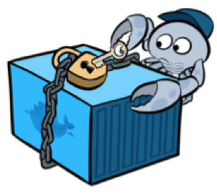
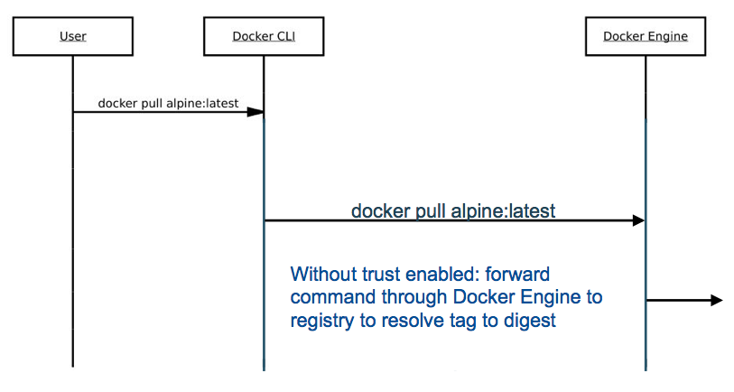
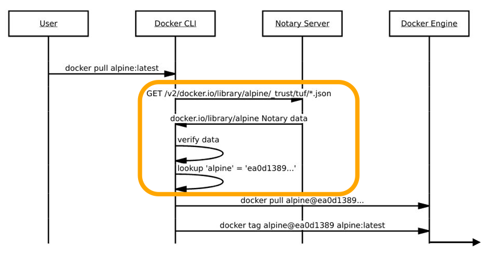
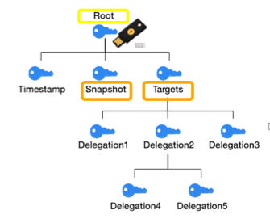
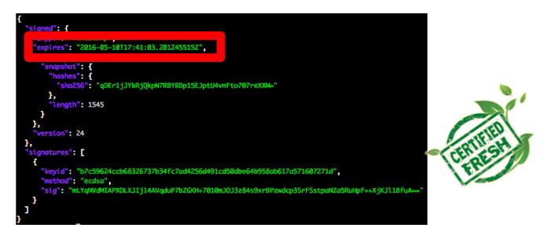
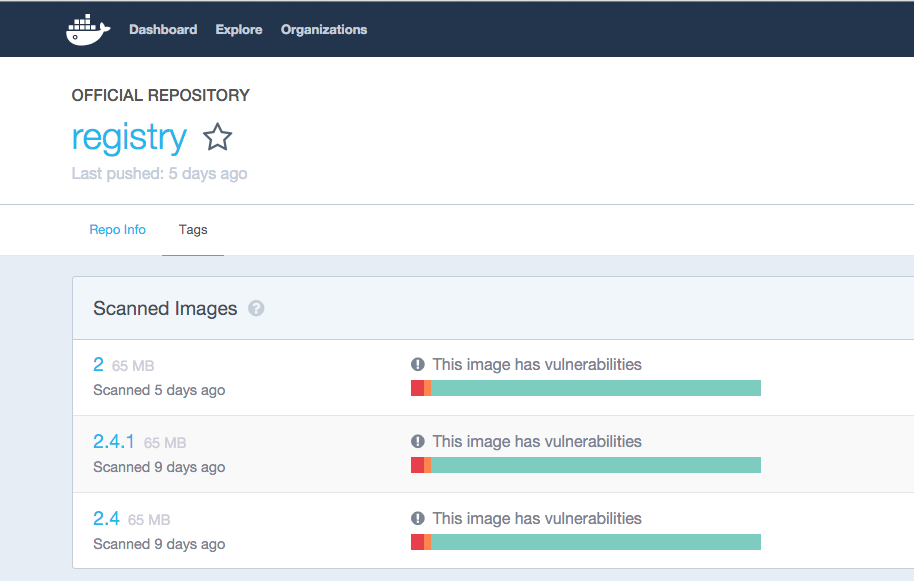

## Access Security: Content Trust

---

## Security Goals

Image Provenance and Trust
- Provenance: who made this image?
  - Verify the publisher of the image
- Trust: have the contents of this image been tampered with?
  - Verify the integrity of the image

---


## Docker Content Trust handles

- Name resolution from image **tags** to image **digests** by signing its own metadata
- when Content Trust is enabled, docker will verify the **signatures** and **expiration dates.**

---
## Docker Pull: Pulling by tag

```
$ docker pull alpine:latest
```
- Name resolution takes place in registry to find content-address of image

```
$ docker pull alpine
Using default tag: latest
```

- latest if no tags

---

## Docker Pull: Pulling by digest

```
$ docker pull alpine@sha256:ea0d1389812...
```

- No name resolution!

- **Security best practice**:
   - pulling by digest to enforce consistent and **immutable** pulls because of content-addressability

Note:

Docker enables you to pull an image by its digest. When pulling an image by digest, you specify exactly which version of an image to pull. Doing so, allows you to “pin” an image to that version, and guarantee that the image you’re using is always the same.

---

## Docker Pull: Content Trust

```
$ export DOCKER_CONTENT_TRUST=1
$ docker pull alpine:latest
```

```
Pull (1 of 1): alpine:latest@sha256:ea0d1389
```

- Benefits of pull by digest with ease of pull by tag



---

## Disable Content Trust

`DOCKER_CONTENT_TRUST=0`




---

## Enable Content Trust

`DOCKER_CONTENT_TRUST=1`



---

##  Docker Content Trust


- Docker Content Trust implements The [Update Framework](https://theupdateframework.github.io/) (TUF)
- TUF uses a key hierarchy to ensure recoverable key compromise and robust freshness guarantees.

- Generate keys for content trust
  - Generate the **root key** and **targets keys** on client-side
  - Generate and store **snapshot keys** and **timestamp** on Docker Registry server
  - **Delegation keys** are optional

Note:

Docker Content Trust: a system currently in the Docker Engine that verifies the publisher of images without sacrificing usability. Docker Content Trust implements The [Update Framework](https://theupdateframework.github.io/) (TUF), an NSF-funded research project succeeding Thandy of the Tor project. TUF uses a key hierarchy to ensure recoverable key compromise and robust freshness guarantees.

When doing a docker push with Content Trust enabled for the first time, the root, targets, snapshot, and timestamp keys are generated automatically for the image repository:

The root and targets key are generated and stored locally client-side.
The timestamp and snapshot keys are safely generated and stored in a signing server that is deployed alongside the Docker registry. These keys are generated in a backend service that isn’t directly exposed to the internet and are encrypted at rest.
Delegation keys are optional, and not generated as part of the normal docker workflow. They need to be manually generated and added to the repository.

https://docs.docker.com/engine/security/trust/trust_key_mng/

Delegation keys are optional tagging keys and allow you to delegate signing image tags to other publishers without having to share your targets key.

---

## Content Trust: Pushing Trusted Content (1/3)

- Tag and push your own signed image with Docker Content Trust.

```
$ export DOCKER_CONTENT_TRUST=1
$ docker tag alpine:latest <user>/alpine:trust
$ docker push <user>/alpine:trust
```
Looks the same as a regular push by tag!


---

## Content Trust: Pushing Trusted Content (2/3)

- The push refers to a repository [<user>/alpine]

```
77f08abee8bf: Pushed
trust: digest: sha256:d5de850d728... size: 1355
Signing and pushing trust metadata
Enter passphrase for root key with ID e83f424:

Enter passphrase for new repository key with ID f903fc9 (docker.io/<user>/alpine):
Repeat passphrase for new repository key with ID f903fc9 (docker.io/<user>/alpine):
Finished initializing "docker.io/<user>/alpine"
Successfully signed "docker.io/<user>/alpine":trust
```



Note:
When you push your first tagged image with content trust enabled, the docker client recognizes this is your first push and:

- alerts you that it will create a new root key
- requests a passphrase for the root key
- generates a root key in the ~/.docker/trust directory
- requests a passphrase for the repository key
- generates a repository key for in the ~/.docker/trust directory
- The passphrase you chose for both the root key and your repository key-pair should be randomly generated and stored in a password manager.

More info: https://docs.docker.com/engine/security/trust/content_trust/


`docker push icho/alpine:trusted` command will prompt you for passphrases. This is because Docker Content Trust is generating a hierarchy of keys with different signing roles. Each key is encrypted with a passphrase, and it is best practice is to provide different passphrases for each key.

The **root key** is the most important key in TUF as it can rotate any other key in the system. The root key should be kept offline, ideally in hardware crypto device. It is stored in ``~/.docker/trust/private/root_keys`` by default.

The **tagging key** is the only local key required to push new tags to an existing repo, and is stored in ``~/.docker/trust/private/tuf_keys`` by default.


---

### Content Trust: Pushing Trusted Content (4/4)

-  Timestamp

```
$ cat ~/.docker/trust/tuf/docker.io/alpine/metadata/timestamp.json | jq
```


---

## Docker Content Trust / Notary Threat Model
- Key compromise?
  - We can recover!
- Replay attacks?
  - Not with our freshness guarantees!
- Untrusted registry?
  - No problem!  DCT/Notary do not root any trust in the underlying content store or transport
  - Use signed TUF metadata to retrieve trusted hashes of content
  - Don’t even need to trust Notary server after first pull - local metadata pins trust, tagging keys are kept client-side for signing

---

## Beat Practice: Docker Pull

- Only pull trusted images
- Use official images when possible!



---

## Hands-On Exercise

www.katacoda.com/docker-training/courses/security-course

**Distribution and Trust** scenario

---
