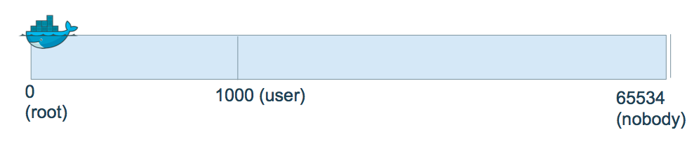
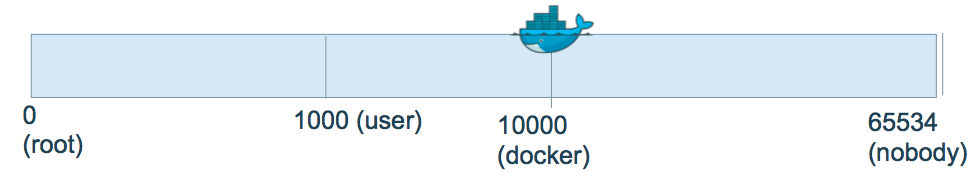
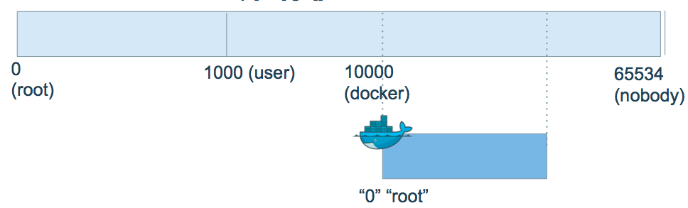
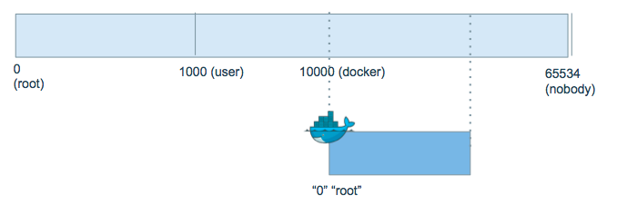

## Platform Security: User UID Management

Note:
One area of isolation and platform security of particular concern is UID management. In a containerized environment, there is only one kernel, which means the spectrum of UIDs in the container is part of the same spectrum of UIDs in the host. This presents a unique attack vector for potentially gaining priveleges on the host.

---

## Default runs as root
```
$ docker run -v /bin:/host/bin -it --rm alpine sh
$ whoami
root
$ id
uid=0(root) gid=0(root)
$ # WREAK HAVOC TIME!  Please don't do this
$ rm /host/bin/sh # Again, please don't do this
```

Note:
 - Recall that there is no VM here; the uid spectrum in the container is part of the host's uid spectrum
 - running as the host's uid 0, which is the default, runs the risk of a container breakout.

---

## Container root user

- root in container == root outside container
- We do not want this to be the case!
- How can we change this?




---

## Step in the right direction: run as a user

- Use the ``--user`` flag with UID:GID argument

```
$ docker run -v /bin:/host/bin --user 1000:10000 -it --rm alpine sh
$ whoami
whoami: unknown uid 10000
$ id
uid=10000 gid=10000

```

---

## But I still want *root* inside container


Run a command that needs to look like `root` in the container, without giving
`root` access to the underlying host

---

## Enable user namespaces

- Use the ``--userns-remap`` flag with UID:GID argument




---

## Enable user namespaces - common pitfalls
```
$ docker daemon --userns-remap [uid[:gid]]
```
- Will need to re-pull images and re-create volumes due to container resource and image layer permissions
- Leave this feature on in production; switching back and forth should only be done in development



---

## Hands-On Exercise
www.katacoda.com/docker-training/courses/security-course

**userns** scenario


---
